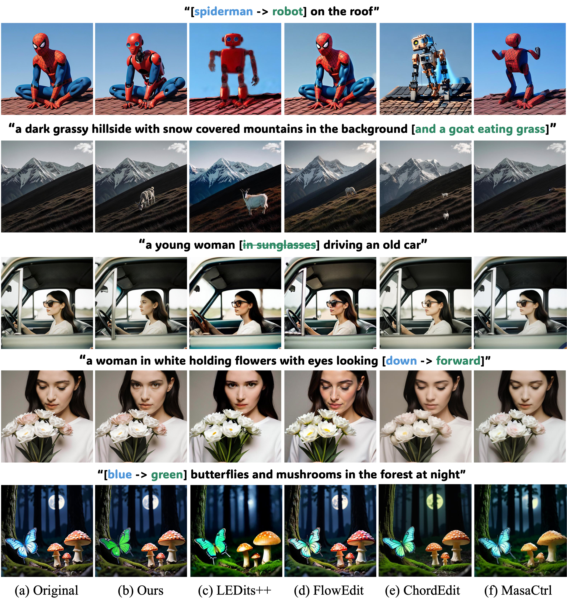

# RefineEdit



**RefineEdit**, a training-free prompt-to-prompt image
editing method built on GRN. RefineEdit reuses an intermediate source state,
selects editable coordinates through source-anchored bit routing, and stabilizes
editing with **adaptive spatial freezing (AdaSF)** and **finite bit locking (FBL)**.

Given a source prompt and an editing prompt, the code generates a source image
and an edited image at **1024 × 1024**. It requires neither additional training
nor an external editing mask. It does **not** directly edit arbitrary real images:
the source refinement trajectory is generated internally from the source prompt.

## 1. Installation

Use Linux and a CUDA GPU with BF16 support. An A100 80 GB is a suitable reference
configuration. This release loads the GRN model, HBQ tokenizer, and UMT5 encoder;
it is not designed for low-memory GPUs or CPU inference.

From the repository root:

```bash
conda create -n refineedit python=3.11 -y
conda activate refineedit

# Install a matching PyTorch / torchvision / CUDA combination first.
python -m pip install torch==2.5.1 torchvision==0.20.1 \
  --index-url https://download.pytorch.org/whl/cu124
python -m pip install -r requirements.txt

# Fast backend used by the original implementation. Requires a compatible CUDA
# toolkit if a prebuilt wheel is unavailable.
python -m pip install packaging ninja
python -m pip install --no-build-isolation -r requirements-flash-attn.txt
```

`requirements.txt` follows the GRN dependency list. It additionally lists the
tokenizer/runtime dependencies explicitly. FlashAttention is installed separately:
this implementation calls the **FlashAttention 2** API, not FlashAttention 4.
The reference environment uses PyTorch 2.5.1, CUDA 12.4, Transformers 4.45.0,
timm 1.0.27, and FlashAttention 2.5.9.post1. To align those library versions:

```bash
python -m pip install transformers==4.45.0 timm==1.0.27
```

If FlashAttention 2 cannot be installed, skip its installation and pass
`--attention-backend sdpa` to use PyTorch scaled dot-product attention. Backend
changes can affect speed, memory use, and numerical results. The same seed does
not guarantee pixel-identical images across different software or attention
backends. No distributed launch or multi-GPU configuration is required.

## 2. Download pretrained weights

Use the pretrained components from the
[official GRN model repository](https://huggingface.co/bytedance-research/GRN).
**No additional RefineEdit checkpoint is required.** Weights are not included
in this source release and are excluded by `.gitignore`.

```bash
python download_weights.py --output-dir weights
```

The downloader fetches only the T2I model, its HBQ tokenizer, and the UMT5 folder.
It defaults to upstream revision `3d4699d4d31fe5e0bf7cc8f25c4d98b315a87a18`
and records the resolved revision in `weights/REVISION.txt`.
To use a specific upstream revision, add `--revision <commit-or-tag>`.
The resulting layout must be:

```text
weights/
├── GRN_T2I_2B_FSA_251600.pth
├── HBQ_image_video_tokenizer_64dim_M4_20260626.ckpt
├── REVISION.txt
└── umt5-xxl/
    ├── models_t5_umt5-xxl-enc-bf16.pth
    └── umt5-xxl/
        ├── tokenizer_config.json
        └── ... tokenizer files ...
```

Keep the nested `umt5-xxl/umt5-xxl/` directory. GRN uses its packaged UMT5 encoder
checkpoint; a generic Transformers model directory is not a drop-in replacement.
If downloading manually, select these exact filenames and the complete
`umt5-xxl/` folder from the official repository. Only use checkpoints from trusted
sources.

Already have these files? Pass `--weights-dir /path/to/weights` instead of copying
them. If components are stored separately, use `--model-path`, `--vae-path`, and
`--text-encoder-path` (the outer `umt5-xxl` directory). Inference does not download
weights automatically.

## 3. Edit a prompt pair

```bash
CUDA_VISIBLE_DEVICES=0 python infer.py \
  --source-prompt "spiderman on the roof" \
  --editing-prompt "robot on the roof" \
  --switch-step 18 \
  --tau-spatial 0.018 \
  --tau-power 0.16 \
  --bit-lock-steps 4 \
  --freeze-multiplier 2.0 \
  --seed 42 \
  --output-dir outputs/cat_to_tiger
```

`<T2I>` is added automatically to both prompts if absent. Do not add it twice.
By default, outputs are lossless PNG images:

```text
outputs/spiderman_to_robot/
├── original/0000.png
├── editing/0000.png
└── inference.jsonl
```

The output directory must be empty to prevent accidental overwrites. To match
earlier JPEG exports, use `--image-format jpg`. JPEG compression changes RGB
values; compare outputs in the same format. `--editing-only` skips saving the
source image, but the source trajectory is still computed.
PIE-Bench category-specific settings are provided in paper Appendix B.2.

### Parameters

| CLI parameter | Default | Meaning |
| --- | --- | --- |
| `--switch-step` | `18` | Zero-based step at which editing branches from the source; valid range is `0` to `steps - 1`. |
| `--tau-spatial` | `0.018` | Threshold on the mean signed probability difference at each spatial position. |
| `--tau-power` | `0.16` | Threshold on the signed probability difference for selecting individual bits. |
| `--bit-lock-steps` | `4` | FBL lifetime, including the activation step; `1` disables temporal carry-over. |
| `--freeze-multiplier` | `2.0` | Sets the AdaSF response threshold to this multiplier times `tau_spatial`. |
| `--steps` | `50` | Total source refinement steps. With switch step 12, editing runs for 38 steps. |
| `--guidance-scale` | `3.0` | Classifier-free guidance scale. |
| `--temperature` | `1.1` | Sampling temperature. |
| `--seed` | `42` | Source RNG seed; the editing RNG uses seed + 1. |

These are starting settings, not a universal optimum for all editing categories.
Set the switch step and two thresholds explicitly for the intended experiment.
Increasing a threshold tightens instantaneous selection for fixed probabilities;
the final editing mask also depends on the evolving branch states.

AdaSF is enabled by default. At the switch step, it measures the mean margin
above `tau_spatial` over selected positions. If that response is at least
`freeze_multiplier * tau_spatial`, it retains the initial spatial mask.
Otherwise, the mask continues updating until the final refinement step, matching
the original implementation. FBL preserves editing permission, not fixed binary
values. A recently selected bit may remain active temporarily even if its
position falls outside the current dynamic spatial mask.

For mechanism ablations, add `--disable-adaptive-spatial-freezing` to disable
AdaSF, or `--bit-lock-steps 1` to disable FBL. Other settings remain unchanged.

## 4. Batch inference and individual samples

A JSONL file contains one pair per nonempty line. Both forms are supported:

```json
["spiderman on the roof", "robot on the roof"]
{"source_prompt": "spiderman on the roof", "editing_prompt": "robot on the roof"}
```

Existing `prompts.txt` files with a JSON array on each line can be used directly.
The model is loaded once and prompt pairs are processed sequentially:

```bash
CUDA_VISIBLE_DEVICES=0 python infer.py \
  --prompts-file examples/prompts.jsonl \
  --output-dir outputs/examples
```

For one selected pair, use its zero-based index and an exclusive end index.
For example, run only pair 1 and export masks every step:

```bash
CUDA_VISIBLE_DEVICES=0 python infer.py \
  --prompts-file examples/prompts.jsonl \
  --start-index 1 --end-index 2 \
  --switch-step 18 --tau-spatial 0.018 --tau-power 0.16 \
  --save-masks --mask-interval 1 \
  --output-dir outputs/example_1_masks
```

The same seed is reset for each pair, matching the original batch script.
File names use the pair's index, not an arbitrary user-supplied path.
Mask exports are placed under `masks/0001/`:

- `mask_summary/step_*.png`: spatial selection on the left and active-bit density
  on the right. Black spatial cells are selected; darker density means a larger
  fraction of active bits, not a larger numerical change to an individual bit.
- `adaptive_bit_lock_stats.csv`: per-step selection and locking diagnostics.

Mask export is optional and adds I/O overhead. `--editing-only --save-masks`
saves edits and masks without saving source images. Check a command without
loading models or requiring a GPU by adding `--dry-run`.

